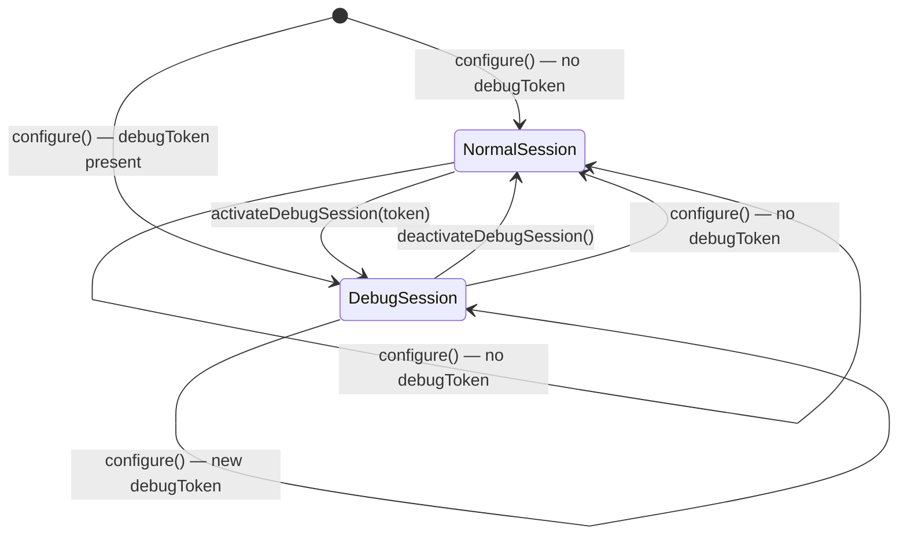
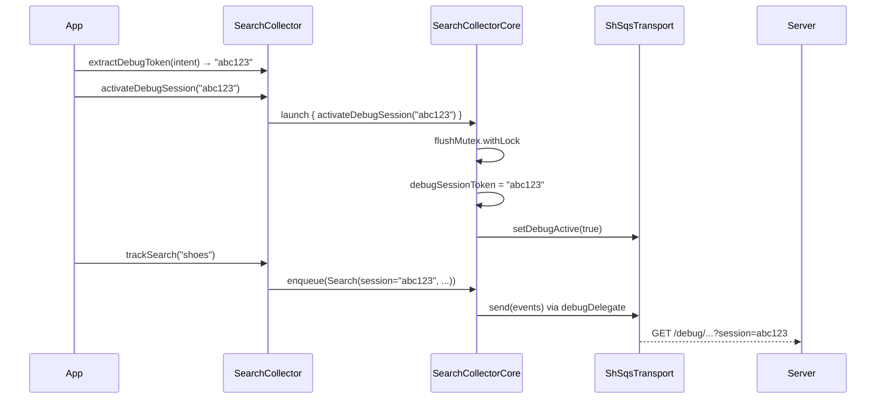

# feat: Add Android debug-session support

## Summary

Extend the Android SDK so that the existing SearchHub debug web app can display events from Android apps. Setting a debug token overrides the session ID (`session` field) in all tracking events **and** routes them to the `/debug` endpoint — both changes are atomic and inseparable. The token is configurable at `configure()` time via `DebugRoutingSettings.debugToken` and switchable at runtime via `activateDebugSession()` / `deactivateDebugSession()`. A pure `extractDebugToken(intent)` helper extracts the token from a deep-link Intent without side effects.

---

## Problem Frame

The debug web app currently only works with browser-based JS tracking: a token is embedded in the shop URL, JS picks it up as the session ID, and the `/debug` endpoint routes those events to the debug viewer. Android apps have no URL mechanism — there is no way to pass the token to the running SDK, and the transport layer has no runtime switching capability. This plan closes both gaps within the SDK; corresponding changes to the debug web app (accepting app deep-link URLs as entry points) are tracked separately.

---

## Key Technical Decisions

**`DebugRoutingSettings.debugToken` as the config-time activation field.** Adding `debugToken: String?` to the existing `DebugRoutingSettings` data class groups all debug configuration at one place (`enabled`, `debugEndpoint`, `debugToken`). Token presence implies debug routing is active regardless of the `enabled` flag — `debugToken != null` is always the stronger signal. (see origin: `docs/brainstorms/2026-06-10-android-debug-session-requirements.md`)

**`ShSqsTransport` extended to hold both delegates and toggle at runtime.** `HttpGetTransport` bakes its endpoint URL as an immutable value at construction time — there is no mutation point. Rather than forcing a full reconfigure to switch endpoints, `ShSqsTransport` is changed to pre-resolve both prod and debug URLs at construction and hold two `HttpGetTransport` instances. A `@Volatile` flag selects which delegate `send()` uses. The `Transport` interface is unchanged; the toggle method is `internal` on `ShSqsTransport`.

**`flushMutex` in `SearchCollectorCore` guarantees activation atomicity (R4).** `debugSessionToken` lives in `SearchCollectorCore` and the transport routing flag lives in `ShSqsTransport` — two separate objects. Without coordination, a flush could start between the two writes, sending events to the wrong endpoint with the wrong session ID. `activateDebugSession()` and `deactivateDebugSession()` inside `SearchCollectorCore` acquire `flushMutex` before writing both values, ensuring no flush is in progress when the state switches.

**Session override via `@Volatile debugSessionToken` on `SearchCollectorCore`, analogous to `timestampOverride`.** `getCommonProperties()` is the single resolution point for the session ID. Adding `debugSessionToken ?: sessionStore.getOrCreateSessionId()` there requires no changes to the `SessionStore` interface or its implementations. `sessionStore.touch()` continues to run unconditionally so the underlying session stays alive and is returned immediately when the debug session ends.

**`activateDebugSession()` throws `IllegalStateException` when called before `configure()`.** R1 explicitly scopes the method to post-configure use. The transport debug flag can only be set after `ShSqsTransport` is created at configure time, making pre-configure buffering structurally impossible without significant additional complexity. A clear exception surfaces the mistake immediately rather than silently dropping the activation.

**Custom transport: session override works; routing is the caller's responsibility.** When `DependencyOverrides.transport` is set, `ShSqsTransport` is not created by `configure()`. The cast `transport as? ShSqsTransport` inside `SearchCollectorCore` returns null; routing-switch calls become no-ops. The `debugSessionToken` override still applies to all events. A warning is logged at activation time so integrators with custom transports are not silently surprised.

---

## High-Level Technical Design

### Debug session state machine

In **NormalSession**, events use `sessionStore.getOrCreateSessionId()` as `session` and route to the production endpoint. In **DebugSession**, events use `debugToken` as `session` and route to the `/debug`-prefixed endpoint.

### Runtime activation sequence (F1)

---

## Implementation Units

### U1. Extend `ShSqsTransport` to hold both delegates and support runtime toggle

**Goal:** Make endpoint routing switchable at runtime without changing the `Transport` interface.

**Requirements:** R1, R4 (routing side)

**Dependencies:** none

**Files:**
- `library/src/main/kotlin/io/searchhub/collector/impl/transport/ShSqsTransport.kt`
- `library/src/test/kotlin/io/searchhub/collector/ShSqsTransportTest.kt`

**Approach:** Replace the single `delegate: HttpGetTransport` with `prodDelegate` and `debugDelegate`, each pre-resolved at construction. `prodDelegate` always uses the prod URL (`resolveEndpoint(queueUrl, false)`). `debugDelegate` uses `debugEndpoint ?: resolveEndpoint(queueUrl, true)`. A `@Volatile private var debugActive: Boolean` is initialised from the existing `debugEnabled` / `isDebugBuild()` logic, preserving backward compatibility. `send()` delegates to whichever is currently active. Add `internal fun setDebugActive(active: Boolean)`.

**Patterns to follow:** The existing `resolveEndpoint()` companion function and `isDebugBuild()` helper — reuse them unchanged. The `@Volatile` pattern used on `SearchCollector.core`.

**Test scenarios:**
- `debugEnabled = true` at construction → `debugActive` starts `true`, `send()` reaches debug URL.
- `debugEnabled = false` at construction → `debugActive` starts `false`, `send()` reaches prod URL.
- `debugEnabled = null` in a non-debug build → `debugActive` starts `false`.
- `setDebugActive(true)` on a prod-mode instance → subsequent `send()` reaches debug URL.
- `setDebugActive(false)` on a debug-mode instance → subsequent `send()` reaches prod URL.
- `debugEndpoint` param provided → debug delegate uses the custom URL; prod delegate uses the unmodified `queueUrl`.
- Construction with the same args as before the change produces the same initial routing (backward-compat regression).

**Verification:** All existing `ShSqsTransportTest` cases pass unchanged. New toggle tests pass. `send()` never throws when switching between delegates.

---

### U2. Add `debugSessionToken` and activation methods to `SearchCollectorCore`

**Goal:** Allow the session ID to be overridden at runtime without modifying `SessionStore`, and guarantee that session and transport state switch atomically.

**Requirements:** R1, R3, R4 (session side), R8

**Dependencies:** U1

**Files:**
- `library/src/main/kotlin/io/searchhub/collector/SearchCollectorCore.kt`
- `library/src/test/kotlin/io/searchhub/collector/SearchCollectorCoreTest.kt`

**Approach:**
- Add `@Volatile internal var debugSessionToken: String? = null` alongside the existing `timestampOverride`.
- Compute `private val sqsTransport: ShSqsTransport? = transport as? ShSqsTransport` from the constructor param — null when a custom transport override is in use.
- In `getCommonProperties()`, replace `sessionStore.getOrCreateSessionId()` with `debugSessionToken ?: sessionStore.getOrCreateSessionId()`. `sessionStore.touch()` continues to run unconditionally.
- Add `internal suspend fun activateDebugSession(token: String)` that acquires `flushMutex.withLock` and sets both `debugSessionToken = token` and `sqsTransport?.setDebugActive(true)`. When `sqsTransport` is null (custom transport), logs a warning that routing is not managed by the SDK.
- Add `internal suspend fun deactivateDebugSession()` that acquires `flushMutex.withLock` and clears `debugSessionToken = null` and `sqsTransport?.setDebugActive(false)`.

**Patterns to follow:** `timestampOverride` for the volatile field shape. `flushMutex.withLock` usage in the existing `flush()` method for the mutex pattern.

**Test scenarios:**
- `getCommonProperties()` returns `debugSessionToken` when set, ignoring the session store.
- `getCommonProperties()` returns `sessionStore.getOrCreateSessionId()` when `debugSessionToken` is null.
- `activateDebugSession("tok")` sets `debugSessionToken = "tok"` and calls `setDebugActive(true)` on the transport.
- `deactivateDebugSession()` clears `debugSessionToken` to null and calls `setDebugActive(false)`.
- Activation while a flush is in progress: flush completes fully before activation takes effect (mutex serialises them).
- Custom transport (sqsTransport == null): activation sets `debugSessionToken` without crashing; no transport call is made.
- Events emitted after activation carry the token as `session`; events emitted after deactivation carry the normal session store ID.

**Covers:** AE1, AE2, AE4 (from origin requirements doc)

**Verification:** All existing `SearchCollectorCoreTest` cases pass. New activation tests pass. No event emitted during a single flush carries a mixed session/routing state.

---

### U3. Extend `DebugRoutingSettings` with `debugToken` and wire it in `configure()`

**Goal:** Allow a debug session to be activated at configure time via config, with `debugToken` presence implying debug routing regardless of `enabled`.

**Requirements:** R2, R3, R4, R7

**Dependencies:** U1, U2

**Files:**
- `library/src/main/kotlin/io/searchhub/collector/model/Config.kt`
- `library/src/main/kotlin/io/searchhub/collector/SearchCollector.kt`
- `library/src/test/kotlin/io/searchhub/collector/SearchCollectorTest.kt`

**Approach:**
- Add `val debugToken: String? = null` to `DebugRoutingSettings`.
- In `SearchCollector.configure()`, after constructing `newCore` and before assigning `core = newCore`:
  - If `config.debugRouting?.debugToken != null`, set `newCore.debugSessionToken = config.debugRouting.debugToken`.
  - Cast the transport to `ShSqsTransport?` and call `setDebugActive(true)` — this activates debug routing immediately, overriding whatever the `enabled` flag resolved to.
- Both writes happen before `core = newCore` is visible to other threads, so no mutex is needed here (the core isn't accessible yet).
- Pre-configure buffered events replayed after `core = newCore` will use `debugSessionToken` because it is already set at that point.

**Patterns to follow:** The existing `config.debugRouting?.enabled` and `config.debugRouting?.debugEndpoint` wiring in `configure()`.

**Test scenarios:**
- `DebugRoutingSettings(debugToken = "tok")`: first flushed event uses `session = "tok"` and targets the debug endpoint.
- `DebugRoutingSettings(debugToken = "tok", enabled = false)`: token wins — debug routing is active.
- `DebugRoutingSettings(debugToken = null)`: no change from current behaviour.
- `debugToken` with a custom `DependencyOverrides.transport`: `session = "tok"` applied; no crash from transport cast; warning logged.
- Pre-configure buffered events after `configure(debugToken = "tok")`: replayed events carry `session = "tok"`.

**Covers:** AE1 (config-time path), F2

**Verification:** `SearchCollectorTest` cases covering existing `debugRouting` config still pass. New config-time token test cases pass.

---

### U4. Public API: `activateDebugSession`, `deactivateDebugSession`, `extractDebugToken`

**Goal:** Expose the debug session controls on the public `SearchCollector` object and provide a pure Intent helper for the deep-link flow.

**Requirements:** R1, R5, R6, R7, R8

**Dependencies:** U2, U3

**Files:**
- `library/src/main/kotlin/io/searchhub/collector/SearchCollector.kt`
- `library/src/test/kotlin/io/searchhub/collector/SearchCollectorTest.kt`

**Approach:**

`activateDebugSession(token: String)`:
- If `core == null`, throw `IllegalStateException` with a clear message directing the caller to invoke `configure()` first.
- Otherwise, fire `core.launch { core.activateDebugSession(token) }` (fire-and-forget, consistent with other `SearchCollector` methods that modify core state).
- Annotate `@JvmStatic` for Java compatibility.

`deactivateDebugSession()`:
- Same null-check with `IllegalStateException`.
- Fire `core.launch { core.deactivateDebugSession() }`.
- Annotate `@JvmStatic`.

`extractDebugToken(intent: android.content.Intent): String?`:
- Pure function: returns `intent.data?.getQueryParameter(DEBUG_TOKEN_PARAM)`.
- No side effects, no state changes.
- Annotate `@JvmStatic`.

`DEBUG_TOKEN_PARAM`:
- Add `const val DEBUG_TOKEN_PARAM = "sid"` as a public companion-object constant so app developers and the web app spec share a single authoritative name.

**Patterns to follow:** The `fireAndForget` / `core.launch` pattern used by all other public tracking methods. The `@JvmStatic` + `@JvmOverloads` annotations on existing methods.

**Test scenarios:**
- `activateDebugSession("tok")` before `configure()`: throws `IllegalStateException`.
- `deactivateDebugSession()` before `configure()`: throws `IllegalStateException`.
- `activateDebugSession("tok")` after `configure()`: next flushed event carries `session = "tok"` and targets the debug endpoint.
- `deactivateDebugSession()` after activation: next flushed event carries the normal session store ID and targets the production endpoint.
- `extractDebugToken` with an Intent whose data URI contains `?sid=abc123`: returns `"abc123"`. Covers AE3.
- `extractDebugToken` with an Intent whose data URI has no `sid` parameter: returns `null`.
- `extractDebugToken` with `intent.data == null`: returns `null` without throwing.
- `extractDebugToken` with `?sid=` (empty value): returns `""` — no SDK-level validation, caller is responsible.
- After `extractDebugToken`, no state has changed (session store and routing are unaffected). Covers AE3 (no side effects).

**Covers:** AE2, AE3, AE4

**Verification:** All new test cases pass. Robolectric-based `SearchCollectorTest` integration cases confirm end-to-end event flow for activation and deactivation. `DEBUG_TOKEN_PARAM` constant is accessible from Java.

---

## Scope Boundaries

**Deferred for later**
- QR code scanning as a built-in SDK mechanism — requires camera permission and a scanning library; the debug web app generates a QR of the tokenized deep link instead.
- Bidirectional registration (app pushes its session ID to the debug endpoint rather than receiving a token from it).
- Client-side token expiry enforcement — the server expires tokens after 12 hours of inactivity; the SDK does not track the TTL.

**Outside this scope**
- Debug web app changes (R9–R11 from the origin requirements doc) — separate repository.
- Debugging end-user production sessions — this feature targets developer and QA workflows only.

**Deferred to follow-up work**
- Flushing the existing event queue before activation to avoid pre-activation events reaching the debug endpoint with a stale session ID. The current behaviour ("activation takes effect for the next event enqueued") is acceptable for a debug-only feature; a suspending `activateDebugSession` with an implicit flush can be added if QA teams report confusion.

---

## Dependencies / Assumptions

- `ShSqsTransport.resolveEndpoint()` already produces correct prod and debug URLs; U1 reuses it unchanged for both delegates.
- The debug endpoint on the server already accepts events with an arbitrary `session` value matching the token — no server-side changes are needed.
- App developers are responsible for registering the deep-link intent filter in `AndroidManifest.xml`. The SDK documents `DEBUG_TOKEN_PARAM` as the canonical query parameter name.
- When `DependencyOverrides.transport` is provided, routing switching is the custom transport's responsibility. This limitation is documented in KDoc on `activateDebugSession`.

---

## Sources & Research

- `docs/brainstorms/2026-06-10-android-debug-session-requirements.md` — origin requirements; R1–R8, AE1–AE4, F1–F2 are the traceability anchors for this plan.
- `library/src/main/kotlin/io/searchhub/collector/SearchCollectorCore.kt` — `timestampOverride` and `flushMutex` patterns that U2 follows directly.
- `library/src/main/kotlin/io/searchhub/collector/impl/transport/ShSqsTransport.kt` — `resolveEndpoint()` and current single-delegate architecture that U1 extends.
- `library/src/main/kotlin/io/searchhub/collector/SearchCollector.kt` — `configure()` wiring and `fireAndForget` pattern that U3 and U4 follow.
- `docs/solutions/runtime-errors/kotlinx-serialization-sealed-class-discriminator-conflict.md` — confirmed no new event fields are needed; the debug token flows through `getCommonProperties()` into the existing `session` field, so serialisation is unaffected.
