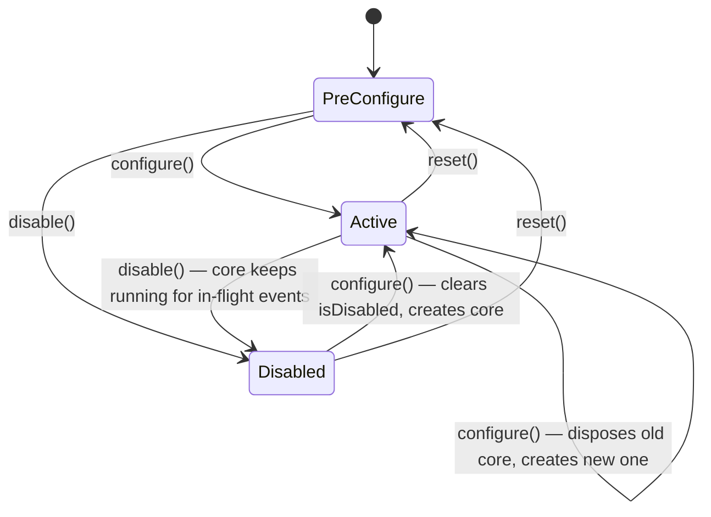
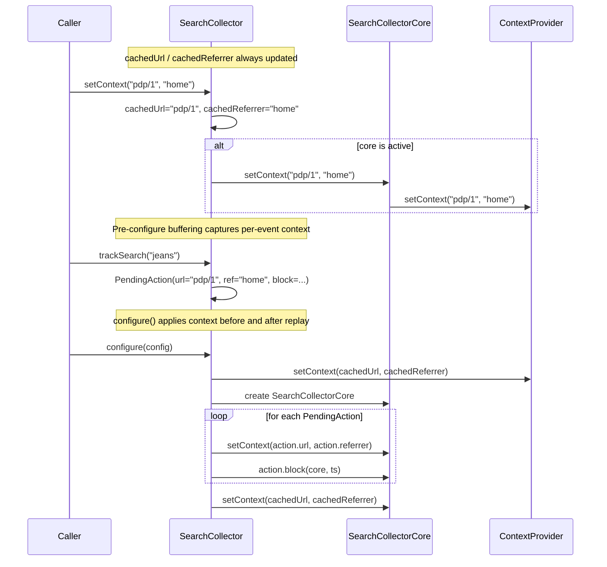

# feat: SDK Integration Improvements

## Summary

Add `disable()`, `setContext()`, `flushAsync()`, and `clearPendingActions()` to the public `SearchCollector` API; cap the pre-configure pending queue; fix `DebugRoutingSettings.enabled = null` to auto-detect debug builds; and document `url`/`ref` semantics for Android. All changes are confined to the `:library` module.

---

## Problem Frame

An external integrator operating a modularised multi-country app surfaced six gaps: no way to signal that tracking is off for a given user (unbounded pending queue), no way to update screen context after `configure()`, an asymmetric `flush()` API forcing non-trivial callers to manage a coroutine scope, undocumented `url`/`ref` semantics, a `DebugRoutingSettings.enabled = null` that silently resolves to `false` rather than auto-detecting the build type, and an absent clearing utility for the pre-configure buffer. (see origin: `docs/brainstorms/2026-06-26-sdk-integration-improvements-requirements.md`)

---

## Key Technical Decisions

**fireAndForget() becomes three-state.** The current `fireAndForget()` is 2-state (`core != null → execute`, `else → buffer`). Adding `disable()` requires a third branch checked first: `isDisabled → discard`. The flag lives on the `SearchCollector` object alongside `core` as `@Volatile private var isDisabled = false`. The core is not disposed on `disable()` — events already in the `EventQueue` continue to flush normally.

**Per-event url/ref capture in PendingAction.** `PendingAction` gains `url: String` and `referrer: String` fields populated at queue time from cached `SearchCollector` fields. At replay time the loop applies `core.setContext(action.url, action.referrer)` before executing each action's block. After the loop, the cached values are re-applied once more so the active provider reflects the current screen, not the last replayed event's screen.

**setContext() delegates synchronously, not via launch().** `ContextProvider.setContext()` is non-suspending (it mutates plain state). `SearchCollector.setContext()` can therefore call `core?.setContext(url, referrer)` directly without launching a coroutine — consistent with the direct var mutation in `AndroidContextProvider`.

**ContextProvider interface gains setContext() with a default no-op.** Kotlin interface default implementations mean existing custom `ContextProvider` implementations compile unchanged. `AndroidContextProvider.setContext()` overrides to call the already-existing `setUrl()` and `setReferrer()`. `AndroidContextProvider.currentUrl` and `referrer` are promoted to `@Volatile` because `setContext()` introduces cross-thread writes that did not exist before.

**maxPendingActions cached on SearchCollector.** `SearchCollector` does not retain the config object after `configure()`. The cap value is extracted at configure-time into `@Volatile private var maxPendingActions: Int = 250` and read in `fireAndForget()`. The configurable value lives in `QueueSettings` alongside the existing `maxBatchSize`.

**DebugRoutingSettings fix is a one-liner in configure().** `DebugRoutingSettings.enabled` is already `Boolean?`; the model is correct. The bug is in `configure()` where `config.debugRouting?.enabled ?: false` is changed to `config.debugRouting?.enabled ?: (Build.VERSION.CODENAME != "REL")`.

---

## High-Level Technical Design

### SearchCollector state machine



*`fireAndForget()` dispatch: `isDisabled=true → discard`, `core != null → execute on core.launch`, `else → buffer to pendingActions`.*

### setContext() flow across components



---

## Requirements

| ID | Summary | Unit |
|----|---------|------|
| R1 | disable() — isDisabled flag, discard, core not disposed | U1 |
| R2 | pending queue cap — maxPendingActions, drop oldest on overflow | U1 |
| R3 | configure() re-enables, replays pending | U1 |
| R4 | setContext() — cached fields, per-event capture, ContextProvider extension | U2 |
| R5 | url/ref documented as screen identifier / previous screen | U2 |
| R6 | flushAsync() — non-suspending fire-and-forget | U3 |
| R7 | flush() suspend form unchanged | U3 |
| R8 | DebugRoutingSettings.enabled=null → auto-detect via CODENAME | U4 |
| R9 | clearPendingActions() — discards buffer, no state change | U1 |

---

## Implementation Units

### U1. Pending Queue Lifecycle

**Goal:** Add `disable()`, `clearPendingActions()`, the `maxPendingActions` cap, and a 3-state `fireAndForget()` to manage the pre-configure event buffer safely.

**Requirements:** R1, R2, R3, R9

**Dependencies:** none

**Files:**
- `library/src/main/kotlin/io/searchhub/collector/model/Config.kt` — modify
- `library/src/main/kotlin/io/searchhub/collector/SearchCollector.kt` — modify
- `library/src/test/kotlin/io/searchhub/collector/SearchCollectorTest.kt` — modify

**Approach:**

*Config.kt:* Add `val maxPendingActions: Int = 250` to `QueueSettings` alongside `maxBatchSize`. Default 250.

*SearchCollector.kt — fields:*
- `@Volatile private var isDisabled = false`
- `@Volatile private var maxPendingActions: Int = 250`
- `PendingAction` gains `val url: String = ""` and `val referrer: String = ""` (internal data class at file bottom — all construction sites are in this file)

*fireAndForget():*
```
if (isDisabled) return
val currentCore = core
if (currentCore != null) {
    currentCore.launch { block(currentCore, ts) }
} else {
    pendingActions.add(PendingAction(ts, cachedUrl, cachedReferrer, block))
    if (pendingActions.size > maxPendingActions) pendingActions.poll()
}
```
`ConcurrentLinkedQueue.size` is O(n) but acceptable for a 250-item cap.

*disable():*
```kotlin
@JvmStatic
fun disable() {
    isDisabled = true
    pendingActions.clear()
}
```
Does not touch `core` — events already in `EventQueue` continue to flush.

*clearPendingActions():*
```kotlin
@JvmStatic
fun clearPendingActions() {
    pendingActions.clear()
}
```

*configure():* At entry, set `isDisabled = false` and `maxPendingActions = config.queueSettings.maxPendingActions`.

**Patterns to follow:** `reset()` in `SearchCollector.kt` for the `pendingActions.clear()` pattern; existing `@Volatile private var core` placement for the new flags.

**Test scenarios:**
- Covers AE1: 50 events buffered → `disable()` → `pendingActions` is empty → 10 further `trackXxx()` → all discarded (verify sent batches stays empty after flush)
- Covers AE2: `maxPendingActions = 5` → 8 calls → queue holds exactly 5 entries (oldest 3 dropped)
- Covers AE3: `disable()` → `configure()` → `trackSearch()` → flush → event received by transport
- Covers AE7: events buffered before configure → `clearPendingActions()` → `configure()` → flush → transport received nothing
- Covers AE8: `configure()` → `clearPendingActions()` → call is a no-op (queue is already empty once active)
- `disable()` after `configure()` (core active): new `trackXxx()` discarded, but flush after disable sends any events that were already in EventQueue before disable was called
- `configure()` after `disable()`: collector re-enables, `isDisabled` is false, new events execute normally
- Cap overflow drops oldest not newest: verify the retained entries are the 5 most recent, not the 5 oldest

**Verification:** `SearchCollectorTest` passes; `disable()`/`clearPendingActions()` happy paths exercise the transport's sent-batch list at or after `flush()`.

---

### U2. Screen Context API

**Goal:** Expose `setContext()` on `SearchCollector`, propagate context into the `ContextProvider` chain, and capture per-event url/ref in `PendingAction` so replayed events carry accurate screen context.

**Requirements:** R4, R5

**Dependencies:** U1 (PendingAction url/ref fields)

**Files:**
- `library/src/main/kotlin/io/searchhub/collector/interfaces/ContextProvider.kt` — modify
- `library/src/main/kotlin/io/searchhub/collector/impl/context/AndroidContextProvider.kt` — modify
- `library/src/main/kotlin/io/searchhub/collector/SearchCollectorCore.kt` — modify
- `library/src/main/kotlin/io/searchhub/collector/SearchCollector.kt` — modify
- `library/src/test/kotlin/io/searchhub/collector/SearchCollectorTest.kt` — modify
- `library/src/test/kotlin/io/searchhub/collector/SearchCollectorCoreTest.kt` — modify
- `library/src/test/kotlin/io/searchhub/collector/AndroidContextProviderTest.kt` — modify

**Approach:**

*ContextProvider.kt:* Add `fun setContext(url: String, referrer: String) {}` as a default no-op. Non-suspending — it only mutates state. Existing implementations remain source-compatible.

*AndroidContextProvider.kt:*
- Promote `private var currentUrl` and `private var referrer` to `@Volatile private var` — `setContext()` may be called from any thread.
- Add `override fun setContext(url: String, referrer: String) { setUrl(url); setReferrer(referrer) }`.

*SearchCollectorCore.kt:* Add `fun setContext(url: String, referrer: String) { contextProvider.setContext(url, referrer) }`.

*SearchCollector.kt — fields:*
- `@Volatile private var cachedUrl: String = ""`
- `@Volatile private var cachedReferrer: String = ""`

*setContext() public method:*
```kotlin
@JvmStatic
fun setContext(url: String, referrer: String = "") {
    cachedUrl = url
    cachedReferrer = referrer
    core?.setContext(url, referrer)
}
```
Synchronous delegation — no `launch()` needed because `setContext()` in the chain is non-suspending.

*configure() — context lifecycle:*
1. After constructing `contextProvider` (and before `newCore` is built): `contextProvider.setContext(cachedUrl, cachedReferrer)`.
2. After `core = newCore` and before replay: the `newCore.setContext(cachedUrl, cachedReferrer)` call is redundant with step 1 for the default provider, but ensures custom providers that implement `setContext()` are also initialised.
3. In the replay loop: call `newCore.setContext(action.url, action.referrer)` before `action.block(newCore, ts)`.
4. After the loop: call `newCore.setContext(cachedUrl, cachedReferrer)` to restore current context so the active provider reflects the present screen, not the last replayed event's screen.

*reset():* Clear `cachedUrl = ""` and `cachedReferrer = ""`.

*KDoc:* On `setContext()` document that in native Android apps `url` is the current screen identifier (e.g. a deep-link path or screen name) and `referrer` is the previous screen — not HTTP URLs. On the `url`/`ref` fields in `SearchCollector`'s `trackXxx()` KDocs (or in a module-level doc comment), note that these are populated automatically from the last `setContext()` call.

**Patterns to follow:** `fireAndForget()` for the `cachedUrl`/`cachedReferrer` read pattern; existing `configure()` replay loop for the extended per-action context call.

**Test scenarios:**
- Covers AE4: `configure()` → `setContext("pdp/12345", "search/results")` → `trackSearch("jeans")` → `flush()` → event carries `url="pdp/12345"`, `ref="search/results"`
- Covers AE5: `setContext("home")` → `trackFiredSearch("jeans")` → `setContext("pdp")` → `trackSearch("blue jeans")` → `configure()` → `flush()` → first event has `url="home"`, second has `url="pdp"`
- After configure() + replay, context in provider matches last `setContext()` call, not last replayed event: call `setContext("final")` before configure(), buffer one event with `url="first"` → after replay, next active event carries `url="final"`
- `setContext()` while disabled: context is cached and applied to core when `configure()` is later called
- Custom `ContextProvider` via `DependencyOverrides`: `setContext()` calls default no-op, does not crash; custom provider's `getCurrentUrl()` returns its own value unaffected
- `SearchCollectorCoreTest`: call `core.setContext("x", "y")` → next event's `url`/`ref` equals `"x"`/`"y"`
- `AndroidContextProviderTest`: `setContext("a", "b")` → `getCurrentUrl() == "a"`, `getReferrer() == "b"`

**Verification:** `SearchCollectorTest`, `SearchCollectorCoreTest`, and `AndroidContextProviderTest` pass; AE4 and AE5 scenarios covered by named test methods.

---

### U3. flushAsync()

**Goal:** Add a non-suspending fire-and-forget flush method so callers who don't manage a coroutine scope can trigger a flush without `suspend`.

**Requirements:** R6, R7

**Dependencies:** none

**Files:**
- `library/src/main/kotlin/io/searchhub/collector/SearchCollector.kt` — modify
- `library/src/test/kotlin/io/searchhub/collector/SearchCollectorTest.kt` — modify

**Approach:**

Add to `SearchCollector`:
```kotlin
@JvmStatic
fun flushAsync() {
    val c = core ?: return
    c.launch { c.flush() }
}
```
`SearchCollectorCore.launch` is `internal` and accessible from `SearchCollector` in the same package. The local `c` capture avoids a TOCTOU race on `core`. `flush()` is unchanged.

**Patterns to follow:** `activateDebugSession()` / `deactivateDebugSession()` in `SearchCollector.kt` for the `val c = core ?: throw/return` capture-then-delegate pattern; `SearchCollectorCore.launch` usage elsewhere in `SearchCollector`.

**Test scenarios:**
- `flushAsync()` before configure → no-op, no exception
- `flushAsync()` after configure with queued events → transport receives batch (use `Thread.sleep(300)` consistent with existing async patterns in `SearchCollectorTest`)
- `suspend flush()` still works and awaits completion — existing `flush()` tests remain green

**Verification:** Existing `flush()` tests unaffected; new `flushAsync()` tests pass.

---

### U4. Debug Routing Auto-Detection

**Goal:** Fix `DebugRoutingSettings.enabled = null` to auto-detect debug builds via `Build.VERSION.CODENAME`.

**Requirements:** R8

**Dependencies:** none

**Files:**
- `library/src/main/kotlin/io/searchhub/collector/SearchCollector.kt` — modify
- `library/src/test/kotlin/io/searchhub/collector/SearchCollectorTest.kt` — modify

**Approach:**

In `configure()`, change:
```kotlin
// before
debugEnabled = config.debugRouting?.enabled ?: false,
// after
debugEnabled = config.debugRouting?.enabled ?: (Build.VERSION.CODENAME != "REL"),
```

Add `import android.os.Build` to `SearchCollector.kt` (not currently present).

No change to `DebugRoutingSettings` or `ShSqsTransport` — the field is already `Boolean?` and `ShSqsTransport` already accepts a `Boolean`.

**Test scenarios:**
- Covers AE6 (release simulation): configure with `enabled = null`, set `Build.VERSION.CODENAME = "REL"` via `ReflectionHelpers.setStaticField(Build.VERSION::class.java, "CODENAME", "REL")` in Robolectric → `ShSqsTransport.activeEndpointUrl` is the production URL
- Covers AE6 (debug simulation): same setup with `CODENAME = "Tiramisu"` → `activeEndpointUrl` is the `/debug` URL
- Explicit `enabled = true` overrides auto-detect regardless of CODENAME
- Explicit `enabled = false` overrides auto-detect regardless of CODENAME
- `debugRouting = null` (no `DebugRoutingSettings` at all) → production endpoint (existing behaviour preserved; `config.debugRouting?.enabled` is null short-circuits to `false` via the CODENAME check on a release build)

**Patterns to follow:** `ShSqsTransportTest.kt` already asserts `activeEndpointUrl` — use the same pattern. Robolectric's `ReflectionHelpers` is available as a test dependency already.

**Verification:** `ShSqsTransport.activeEndpointUrl` assertions pass for all four cases (null/release, null/debug, explicit true, explicit false).

---

## Scope Boundaries

- `price: Double` on `trackBasket()` and `CheckoutProduct` — won't fix (analytics context, not financial)
- Multi-instance `SearchCollector` support — out of scope
- `:library-workmanager` module — no changes required; `SearchCollectorFlushWorker` calls `SearchCollector.flush()` which is unchanged

### Deferred to Follow-Up Work

- Documenting the six-interface + `DependencyOverrides` architecture pattern in `docs/solutions/` — no learnings document exists yet; good candidate after this work lands
- Thread-safety documentation for `AndroidContextProvider` in a solutions doc

---

## Risks & Dependencies

**`pendingActions.size` is O(n) for `ConcurrentLinkedQueue`.** At cap 250, this is a trivial traversal (~1 µs). Not a runtime concern, but if the cap is set very high by a caller, it could become measurable. No mitigation needed for the default.

**Replay coroutine and `setContext()` race.** `configure()` launches replay on `replayScope` (a standalone `CoroutineScope(Dispatchers.IO)`). If `setContext()` is called from the main thread concurrently with replay, the final `newCore.setContext(cachedUrl, cachedReferrer)` call at the end of the replay loop may race with an in-flight `setContext()`. The result is that the active provider has either the value from replay's post-loop call or the concurrent `setContext()` call — both are correct callers-side values. `@Volatile` on `cachedUrl`/`cachedReferrer` ensures the read in the replay sees the latest write. This is an acceptable last-write-wins behaviour.

**Robolectric reflection for `Build.VERSION.CODENAME` in tests.** `ReflectionHelpers.setStaticField` works reliably in Robolectric but must restore the original value in `@After` to avoid leaking state between tests.

---

## Sources & Research

- `docs/brainstorms/2026-06-26-sdk-integration-improvements-requirements.md` — origin requirements
- `docs/solutions/runtime-errors/kotlinx-serialization-sealed-class-discriminator-conflict.md` — fire-and-forget swallows exceptions; flush-asserting tests are essential
- `docs/solutions/logic-errors/event-keywords-query-dual-field-wire-format.md` — `query` field must use `$s=` trail format; default value on event classes is a deserialization shim, not a usable default
- `docs/solutions/logic-errors/android-url-encoding-urlencode-vs-uri-encode.md` — `android.net.Uri.encode()` is mandatory; any test asserting encoded trail strings needs Robolectric
